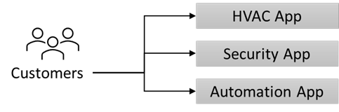

---
casestudy:
  title: Fabrikam Residences
  module: Logging and monitoring solutions
---
# Fallstudie: Fabrikam Residences

## Anforderungen

**In dieser Fallstudie müssen Sie die folgenden Module und Fallstudien abgeschlossen haben: Compute, relationale Daten, nicht relationale Daten, Authentifizierung, Anwendungsarchitektur**

Sie haben eine neue Stelle bei Fabrikam Residences angetreten. Das Unternehmen ist sehr erfolgreich und verzeichnet ein schnelles Wachstum. Fabrikam Residences ist ein Bauunternehmen für Neubauten und größere Renovierungen. Das Unternehmen ist erfolgreich, weil es qualitativ hochwertige Gebäude und neuere integrierte Heimtechniken als seine Konkurrenten anbietet.  

Derzeit werden diese Technologien von verschiedenen Subunternehmen bereitgestellt und verwaltet. Die Eigentümer*innen von Fabrikam Residences möchten diese verbesserten technologischen Optionen ab sofort intern anbieten, um eine bessere Qualität, einen besseren Support und mehr Daten über Kundenverhalten und -bedürfnisse zu erhalten. 
 
Zunächst will das Unternehmen die Steuerung und Überwachung von HLK-Anlagen (Heizung und Kühlung), die Überwachung und Alarmierung von Sicherheitssystemen und die Heimautomatisierung anbieten. Dies erfordert eine neue Website, Datenspeicherungslösung und Datenerfassungslösung.

Das Unternehmen hat in den letzten 2 Jahren ein enormes Wachstum verzeichnet. Das Unternehmen schätzt, dass sich seine Größe in den nächsten 12 bis 18 Monaten verdoppeln wird. Angesichts des rasanten Wachstums auf dem regionalen Markt hat das Unternehmen derzeit keine Pläne, über den regionalen Markt hinaus zu expandieren.

## Aktuelle Situation

Die Fabrikam-Zentrale betreibt ein kleines Rechenzentrum an einem einzigen Ort. Das Rechenzentrum hostet die **Projektmanagementsoftware (PM)** des Unternehmens.

- Die PM-Software verwendet eine Windows-Anwendung eines Drittanbieters. Die Anwendung läuft auf einem 2-Knoten-Netzwerklastenausgleichs-Cluster (NLB) mit einem einzigen Microsoft SQL Server-Back-End.  

- Bilder und Dokumente werden auf einem zugeordneten Laufwerk des Servers gespeichert, das sich auf einer speziellen NAS-Appliance befindet.

- Unternehmensbenutzer*innen und Büromitarbeiter*innen verwenden ein Web-Front-End, um Daten wie Lieferzeitpläne und Änderungsaufträge einzugeben.

-   Die Bauleiter*innen vor Ort verwenden Windows-Laptops und Tablets offline, um den Baufortschritt und andere Details kontinuierlich zu erfassen.  Diese Änderungen, z. B. neue Arbeitsaufträge, werden in einer lokalen Änderungsdatei gespeichert.  Am Ende eines jeden Tages kehren die Bauleiter*innen ins Büro zurück, verbinden sich mit dem drahtlosen Netzwerk und führen ein kleines Skript aus, um die Änderungsdatei auf einen FTP-Server hochzuladen.  Ein zweites Skript wird jede Nacht ausgeführt, um alle Änderungsdateien zu verarbeiten und ihren Inhalt in die Projektmanagemendatenbank (Microsoft SQL Server) einzugeben.

Die **Heimtechniksoftware** wird derzeit von Dritten bereitgestellt und gehostet und umfasst mindestens drei verschiedene Websites, die die Kundin bzw. der Kunde besuchen muss.  Es wird vorgeschlagen, die Software durch eine intern entwickelte und einheitliche Lösung zu ersetzen.

## Anforderungen 

**Projektmanagementsoftware**

- Migrieren Sie so viele Systeme wie möglich zu einem öffentlichen Cloudanbieter.

- Ersetzen Sie die vorhandenen Skripte, um ein sichereres System als FTP zu nutzen, da es Sicherheitsbedenken gab. Außerdem wurden Sie gebeten, dafür zu sorgen, dass Änderungsdateien sofort nach dem Hochladen bearbeitet werden.

- Erhöhen Sie die Widerstandsfähigkeit der Projektmanagementdatenbank. Während die Leistung kein Problem darstellt, möchte das Unternehmen vermeiden, dass der Zugriff auf die Datenbank im Falle des Ausfalls einer einzelnen Hardware verloren geht.

**Neue Heimtechniklösung**

- Fügen Sie eine neue Lösung hinzu, um kontinuierlich Daten von den Heimüberwachungssensoren zu sammeln.
  - Erfassen Sie einige Sensormesswerte in einer Datenbank für Trendanalysen und Berichte.
  - Stellen Sie je nach Bedarf der Eigentümer*innen konfigurierbare Echtzeit-Warnungen bereit.
  
- Entwerfen Sie eine relationale Datenbanklösung, um Präferenzen und Einstellungen für Hauseigentümer*innen zu speichern.
  - Das System muss skalierbar sein.
  - Redundanz ist wichtig.
  
- Die neue einheitliche Website wird intern entwickelt und unter Linux gehostet.  Auf dieser Website können Sie die Überwachungsdaten einsehen und Einstellungen wie Temperatur oder Warnungsschwellenwerte ändern. Die Last kann stark schwanken, und das System muss schnell skalierbar sein.

-   Bieten Sie Benutzer*innen eine Möglichkeit, sich beim System anzumelden, ohne ein anderes Benutzerkonto und Kennwort zu erstellen.

- Implementieren Sie Sicherheitskontrollen und erstellen Sie wöchentliche Berichte, in denen Sie darlegen, wie das Unternehmen im Vergleich zu den branchenüblichen Best Practices abschneidet.

## Aufgaben 

1. Entwerfen Sie eine Lösung für die Projektmanagementsoftware. Seien Sie bereit, zu erläutern, warum Sie die einzelnen Komponenten des Designs ausgewählt haben und wie sie die Lösungsanforderungen erfüllen.

2. Entwerfen Sie eine Architektur für die neue Heimtechniklösung. Seien Sie bereit, zu erläutern, warum Sie die einzelnen Komponenten des Designs ausgewählt haben und wie sie die Lösungsanforderungen erfüllen.

Wie setzen Sie die Säulen des Well-Architected Framework ein, um eine qualitativ hochwertige, stabile und effiziente Cloudarchitektur zu schaffen?

